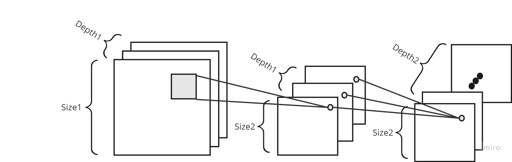

Vitis HLS Implementation of MNIST Handwritten Digit Classification
=

## Algorithm
- This model is inspired from:
    - <https://mike-12.medium.com/depthwise-separable-convolutions-simple-image-classification-with-pytorch-7f7d2ba06af7>
- This model is based on Depthwise Separable Convolution:
    - First, we perform Depthwise Convolution, which involves spatial convolution for each channel.
    - Second, we perform Pointwise Convolution, which involves a weighted sum of the channels for each pixel.
    
- This model consists of three layers of Depthwise Seperatable Convolution.
    || depth | size | kernel size | stride |
    | ---- |---- | ---- | ---- | ---- |
    | image | 1 | 28 | - | - |
    | depth1 | 1 | 10 | 3 | 3 |
    | point1 | 4 | 10 | 1 | 1 |
    | depth2 | 4 | 4 | 3 | 3|
    | point2 | 12 | 4 | 1 | 1 |
    | depth3 | 12 | 1 | 4 | 4 |
    | point3 | 10 | 1 | 1 | 1 |

## Training
- training code: [MNIST_train.ipynb](https://github.com/ayumiohno/mnist_depthwise_hls/blob/main/notebooks/MNIST_train.ipynb)
- trained model and weights:
    - torch model: [model.pth](https://github.com/ayumiohno/mnist_depthwise_hls/blob/main/data/model.pth) 
    - weights only: [params.json](https://github.com/ayumiohno/mnist_depthwise_hls/blob/main/data/params.json)

- Achieved an accuracy of 89.4% with 409 parameters.
## Vitis HLS Implementation
- top: [mnist.cpp](https://github.com/ayumiohno/mnist_depthwise_hls/blob/main/mnist.cpp)
- test bench: [mnist_tb.cpp](https://github.com/ayumiohno/mnist_depthwise_hls/blob/main/mnist_tb.cpp)
### Overview
- Activations are formatted as [Height, Width, Channel].
- Data between modules (depth1, point1, ..., point3) are connected using `hls::stream`.

## Hardware
- Follow the hardware design steps outlined in <https://blog.n-hassy.info/2021/05/vitis-hls-to-fpga-3/>.
    - Note that we need one more DMA IP.
- Install PYNQ on the KV260.
- Run [MNIST_fpga.ipynb](https://github.com/ayumiohno/mnist_depthwise_hls/blob/main/notebooks/MNIST_fpga.ipynb) on PYNQ.

## Results
- Synthesis Summary Report: [csynth.rpt](https://github.com/ayumiohno/mnist_depthwise_hls/blob/main/solution1/syn/report/csynth.rpt)
- I compared the results with PyTorch (CPU) and full-scratch Python implementation on PYNQ.
    - [MNIST_torch.ipynb](https://github.com/ayumiohno/mnist_depthwise_hls/blob/main/notebooks/MNIST_torch.ipynb)
    - [MNIST_scratch.ipynb](https://github.com/ayumiohno/mnist_depthwise_hls/blob/main/notebooks/MNIST_scratch.ipynb)
- Achieved the same result (accurary of 90.5%) with [images.json](https://github.com/ayumiohno/mnist_depthwise_hls/blob/main/data/images.json) and [labels.json](https://github.com/ayumiohno/mnist_depthwise_hls/blob/main/data/labels.json)
- **3.3** times faster than Pytorch on PYNQ. **530** times fater than a full-scratch Python implementation on PYNQ. 
    | | FPGA | PyTorch | Scratch(Python) |
    | ---- | ---- | ---- | ---- |
    | time (ms/picture) | 0.88  | 2.90 | 466 |
